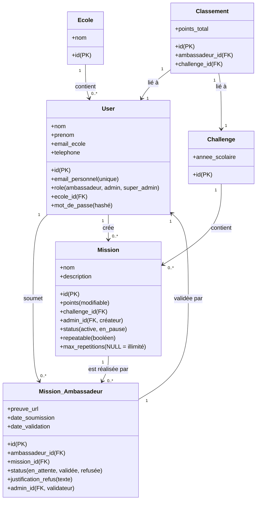

### 📌 Phase 1 : Contexte & Exigences du Projet

J'ai extrait les informations pertinentes du projet à partir des documents fournis. Voici ce que nous savons déjà :

1️⃣ **Contexte du projet** :

- Plateforme en ligne pour la gestion du **Challenge Ambassadeur** des étudiants du **Campus Eduservices de Caen**.
- Objectifs :
  - Automatiser la comptabilisation des points et la vérification des preuves.
  - Offrir une interface utilisateur intuitive pour les ambassadeurs et les administrateurs.
  - Faciliter la gestion et le suivi des missions.

2️⃣ **Données stockées** :

- **Utilisateurs** : Ambassadeurs (étudiants) et Administrateurs.
- **Missions** : Activités réalisées par les ambassadeurs pour gagner des points.
- **Points & Classement** : Scores cumulés et récompenses associées.
- **Preuves** : Fichiers téléchargés ou liens pour valider une mission.
- **Écoles** : Liste des établissements concernés.
- **Années scolaires** : Pour segmenter les challenges par période.

3️⃣ **Volume de données attendu** :

- Nombre d’ambassadeurs potentiels : plusieurs centaines.
- Nombre de missions par ambassadeur : variable, mais plusieurs dizaines possibles.
- Nombre de validations & preuves stockées : probablement des milliers sur plusieurs années.

4️⃣ **Opérations fréquentes** :

- **Ambassadeurs** : Création de compte, soumission de missions, consultation du classement.
- **Administrateurs** : Validation des missions, gestion des ambassadeurs et classement.

5️⃣ **Stockage des fichiers** :

- Les preuves (PDF, images, vidéos) doivent être téléversées et accessibles aux administrateurs.

6️⃣ **Type de base de données** :

- **SQL** .
- Justifications :
  - Relations complexes entre missions, ambassadeurs, points et écoles.
  - Besoin de contraintes et d’intégrité des données (ex: clés étrangères, indexation).
  - Historisation des challenges par année scolaire.

## 📌 Phase 2 : SQL vs NoSQL  

Nous avons validé que **MariaDB** (SQL) sera utilisé. Avant d’entrer dans le détail des entités, voici quelques optimisations potentielles :

1️⃣ **Relations complexes** :  
   - Besoin de **relations entre les ambassadeurs, les missions, les points et les écoles**.  
   - Clés étrangères pour garantir la **cohérence des données**.  

2️⃣ **Contraintes spécifiques** :  
   - **Clés uniques** (Exemple : un ambassadeur ne peut s’inscrire qu’une fois).  
   - **Intégrité référentielle** (Exemple : une mission validée doit être liée à un ambassadeur existant).  

3️⃣ **Indexation** :  
   - Champs à indexer pour **optimiser les requêtes fréquentes** (ex: classement, recherche de missions).  
### ✅ Phase 2 Validée : SQL, Relations et Contraintes  

🔹 **Les missions peuvent être créées à tout moment** par les administrateurs.  
🔹 **Les points attribués aux missions peuvent varier** selon les décisions des administrateurs.  
🔹 **Les missions ont un statut** : elles sont **en attente** par défaut et doivent être validées ou refusées par un administrateur.  

## 📌 **Phase 3 : Définition des Entités & Relations (Version Finale)**  

### 📌 **Entités clés**  

#### 1️⃣ **User (Ambassadeurs et Administrateurs)**  
   - `id` (PK)  
   - `nom`, `prenom`  
   - `email_personnel` (unique)  
   - `email_ecole`  
   - `telephone`  
   - `role` (`ambassadeur`, `admin`, `super_admin`)  
   - `ecole_id` (FK vers École)  
   - `mot_de_passe` (hashé)  

#### 2️⃣ **École**  
   - `id` (PK)  
   - `nom`  

#### 3️⃣ **Challenge (Années scolaires)**  
   - `id` (PK)  
   - `annee_scolaire` (ex: 2025/2026)  

#### 4️⃣ **Mission**  
   - `id` (PK)  
   - `nom`  
   - `description`  
   - `points` (modifiable)  
   - `challenge_id` (FK vers Challenge)  
   - `admin_id` (FK vers User, celui qui a créé la mission)  
   - `status` (`active`, `en_pause`) *(Permet aux admins de désactiver une mission sans impacter les missions déjà validées.)*  
   - `repeatable` (booléen : la mission peut-elle être refaite ?)  
   - `max_repetitions` (int, `NULL` si illimité) *(Nombre maximal de fois qu’un ambassadeur peut faire cette mission par challenge.)*  

#### 5️⃣ **Mission_Ambassadeur (missions réalisées)**  
   - `id` (PK)  
   - `ambassadeur_id` (FK vers User)  
   - `mission_id` (FK vers Mission)  
   - `preuve_url` (fichier sur serveur)  
   - `status` (`en_attente`, `validée`, `refusée`)  
   - `justification_refus` (texte) *(L’ambassadeur peut voir cette justification.)*  
   - `admin_id` (FK vers User, celui qui a validé ou refusé)  
   - `date_soumission`  
   - `date_validation`  

#### 6️⃣ **Classement (Scores des ambassadeurs)**  
   - `id` (PK)  
   - `ambassadeur_id` (FK vers User)  
   - `challenge_id` (FK vers Challenge)  
   - `points_total`  

### Diagrame de Classe

