### 📌 Phase 1 : Contexte & Exigences du Projet

J'ai extrait les informations pertinentes du projet à partir des documents fournis. Voici ce que nous savons déjà :

1️⃣ **Contexte du projet** :

- Plateforme en ligne pour la gestion du **Challenge Ambassadeur** des étudiants du **Campus Eduservices de Caen**.
- Objectifs :
  - Automatiser la comptabilisation des points et la vérification des preuves.
  - Offrir une interface utilisateur intuitive pour les ambassadeurs et les administrateurs.
  - Faciliter la gestion et le suivi des missions.

2️⃣ **Données stockées** :

- **Utilisateurs** : Ambassadeurs (étudiants) et Administrateurs.
- **Missions** : Activités réalisées par les ambassadeurs pour gagner des points.
- **Points & Classement** : Scores cumulés et récompenses associées.
- **Preuves** : Fichiers téléchargés ou liens pour valider une mission.
- **Écoles** : Liste des établissements concernés.
- **Années scolaires** : Pour segmenter les challenges par période.

3️⃣ **Volume de données attendu** :

- Nombre d’ambassadeurs potentiels : plusieurs centaines.
- Nombre de missions par ambassadeur : variable, mais plusieurs dizaines possibles.
- Nombre de validations & preuves stockées : probablement des milliers sur plusieurs années.

4️⃣ **Opérations fréquentes** :

- **Ambassadeurs** : Création de compte, soumission de missions, consultation du classement.
- **Administrateurs** : Validation des missions, gestion des ambassadeurs et classement.

5️⃣ **Stockage des fichiers** :

- Les preuves (PDF, images, vidéos) doivent être téléversées et accessibles aux administrateurs.

6️⃣ **Type de base de données** :

- **SQL** .
- Justifications :
  - Relations complexes entre missions, ambassadeurs, points et écoles.
  - Besoin de contraintes et d’intégrité des données (ex: clés étrangères, indexation).
  - Historisation des challenges par année scolaire.

## 📌 Phase 2 : SQL vs NoSQL  

Nous avons validé que **MariaDB** (SQL) sera utilisé. Avant d’entrer dans le détail des entités, voici quelques optimisations potentielles :

1️⃣ **Relations complexes** :  
   - Besoin de **relations entre les ambassadeurs, les missions, les points et les écoles**.  
   - Clés étrangères pour garantir la **cohérence des données**.  

2️⃣ **Contraintes spécifiques** :  
   - **Clés uniques** (Exemple : un ambassadeur ne peut s’inscrire qu’une fois).  
   - **Intégrité référentielle** (Exemple : une mission validée doit être liée à un ambassadeur existant).  

3️⃣ **Indexation** :  
   - Champs à indexer pour **optimiser les requêtes fréquentes** (ex: classement, recherche de missions).  
### ✅ Phase 2 Validée : SQL, Relations et Contraintes  

🔹 **Les missions peuvent être créées à tout moment** par les administrateurs.  
🔹 **Les points attribués aux missions peuvent varier** selon les décisions des administrateurs.  
🔹 **Les missions ont un statut** : elles sont **en attente** par défaut et doivent être validées ou refusées par un administrateur.  

## 📌 **Phase 3 : Définition des Entités & Relations (Version Finale)**  

### 📌 **Entités clés**  

#### 1️⃣ **User (Ambassadeurs et Administrateurs)**  
   - `id` (PK)  
   - `nom`, `prenom`  
   - `email_personnel` (unique)  
   - `email_ecole`  
   - `telephone`  
   - `role` (`ambassadeur`, `admin`, `super_admin`)  
   - `ecole_id` (FK vers École)  
   - `mot_de_passe` (hashé)  

#### 2️⃣ **École**  
   - `id` (PK)  
   - `nom`  

#### 3️⃣ **Challenge (Années scolaires)**  
   - `id` (PK)  
   - `annee_scolaire` (ex: 2025/2026)  

#### 4️⃣ **Mission**  
   - `id` (PK)  
   - `nom`  
   - `description`  
   - `points` (modifiable)  
   - `challenge_id` (FK vers Challenge)  
   - `admin_id` (FK vers User, celui qui a créé la mission)  
   - `status` (`active`, `en_pause`) *(Permet aux admins de désactiver une mission sans impacter les missions déjà validées.)*  
   - `repeatable` (booléen : la mission peut-elle être refaite ?)  
   - `max_repetitions` (int, `NULL` si illimité) *(Nombre maximal de fois qu’un ambassadeur peut faire cette mission par challenge.)*  

#### 5️⃣ **Mission_Ambassadeur (missions réalisées)**  
   - `id` (PK)  
   - `ambassadeur_id` (FK vers User)  
   - `mission_id` (FK vers Mission)  
   - `preuve_url` (fichier sur serveur)  
   - `status` (`en_attente`, `validée`, `refusée`)  
   - `justification_refus` (texte) *(L’ambassadeur peut voir cette justification.)*  
   - `admin_id` (FK vers User, celui qui a validé ou refusé)  
   - `date_soumission`  
   - `date_validation`  

#### 6️⃣ **Classement (Scores des ambassadeurs)**  
   - `id` (PK)  
   - `ambassadeur_id` (FK vers User)  
   - `challenge_id` (FK vers Challenge)  
   - `points_total`  

### Diagrame de Classe

```mermaid
classDiagram
    class User {
        +id (PK)
        +nom
        +prenom
        +email_personnel (unique)
        +email_ecole
        +telephone
        +role (ambassadeur, admin, super_admin)
        +ecole_id (FK)
        +mot_de_passe (hashé)
    }

    class Ecole {
        +id (PK)
        +nom
    }

    class Challenge {
        +id (PK)
        +annee_scolaire
    }

    class Mission {
        +id (PK)
        +nom
        +description
        +points (modifiable)
        +challenge_id (FK)
        +admin_id (FK, créateur)
        +status (active, en_pause)
        +repeatable (booléen)
        +max_repetitions (NULL = illimité)
    }

    class Mission_Ambassadeur {
        +id (PK)
        +ambassadeur_id (FK)
        +mission_id (FK)
        +preuve_url
        +status (en_attente, validée, refusée)
        +justification_refus (texte)
        +admin_id (FK, validateur)
        +date_soumission
        +date_validation
    }

    class Classement {
        +id (PK)
        +ambassadeur_id (FK)
        +challenge_id (FK)
        +points_total
    }

    %% Relations entre les entités
    User "1" --> "0..*" Mission_Ambassadeur : soumet
    Ecole "1" --> "0..*" User : contient
    Challenge "1" --> "0..*" Mission : contient
    Mission "1" --> "0..*" Mission_Ambassadeur : est réalisée par
    User "1" --> "0..*" Mission : crée
    Mission_Ambassadeur "1" --> "1" User : validée par
    Classement "1" --> "1" User : lié à
    Classement "1" --> "1" Challenge : lié à
```

### ✅ Phase 5 : Optimisation des Performances & Indexation 🚀  

Nous avons maintenant optimisé la base de données pour **assurer des requêtes rapides et éviter les ralentissements**.  

---

## 📌 **Indexation recommandée**  
L’indexation permet d’**accélérer les requêtes** en optimisant les champs fréquemment utilisés dans les **recherches, tris et filtres**.

| Table                   | Champ à indexer            | Raison                                                       |
| ----------------------- | -------------------------- | ------------------------------------------------------------ |
| **User**                | `email_personnel (unique)` | Recherche rapide des utilisateurs & authentification         |
| **User**                | `ecole_id`                 | Filtrage rapide des ambassadeurs par école                   |
| **User**                | `role`                     | Différenciation rapide entre ambassadeurs et administrateurs |
| **Mission_Ambassadeur** | `ambassadeur_id`           | Accélération de la récupération des missions par ambassadeur |
| **Mission_Ambassadeur** | `mission_id`               | Optimisation des requêtes de validation des missions         |
| **Mission_Ambassadeur** | `status`                   | Recherche rapide des missions en attente/validées/refusées   |
| **Mission_Ambassadeur** | `date_soumission`          | Affichage rapide des missions récentes                       |
| **Mission**             | `challenge_id`             | Filtrage des missions par année scolaire                     |
| **Mission**             | `max_repetitions`          | Filtrage rapide des missions répétables                      |
| **Classement**          | `challenge_id`             | Accélération des calculs de classement par année             |
| **Classement**          | `points_total`             | Tri rapide des classements par score                         |

---

## 📌 **Optimisations supplémentaires**
✅ **Foreign Keys (FK) bien définies** pour **assurer l’intégrité des données**  
✅ **Utilisation de `TEXT` pour `justification_refus`**, évitant les limitations de `VARCHAR`  
✅ **Compression des index sur les gros champs (`email_personnel`, `nom`)** pour **économiser de l’espace**  
✅ **Stockage des fichiers en dehors de la BDD** pour **éviter d’alourdir les requêtes**  

