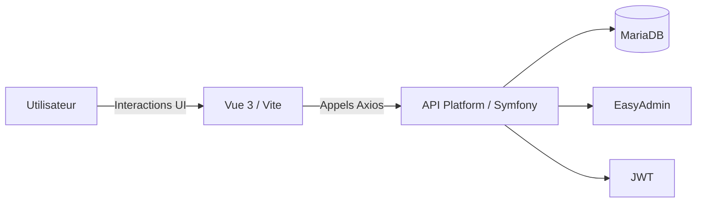
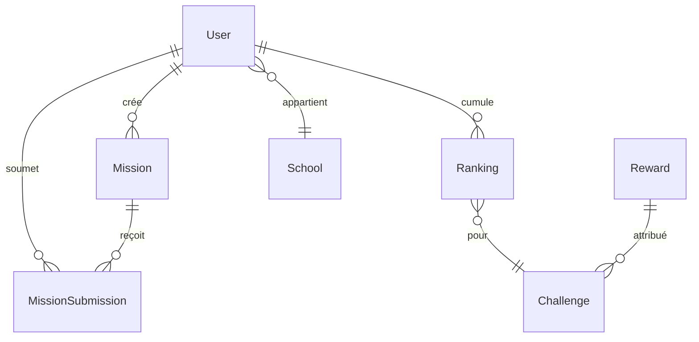
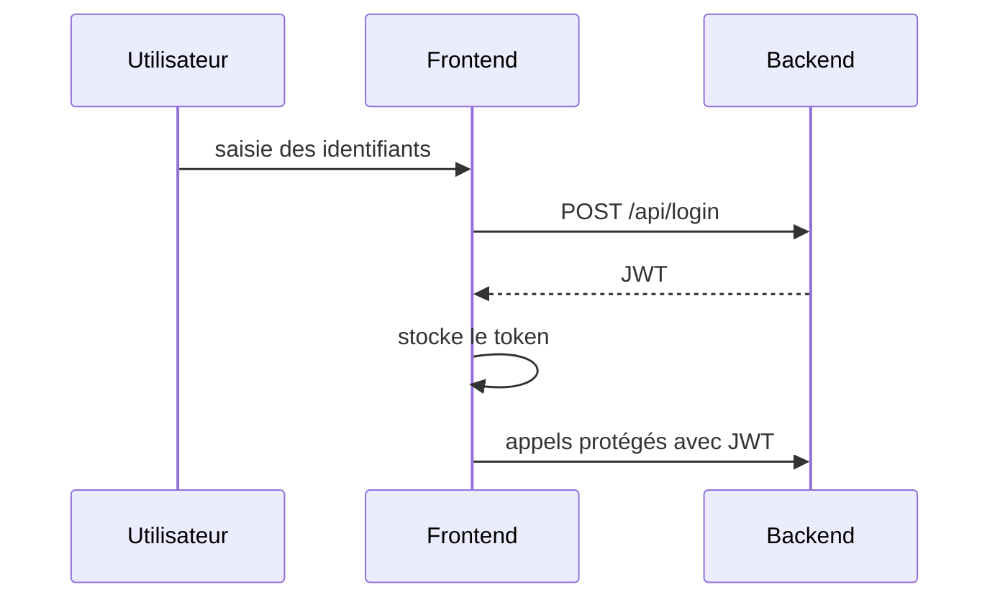
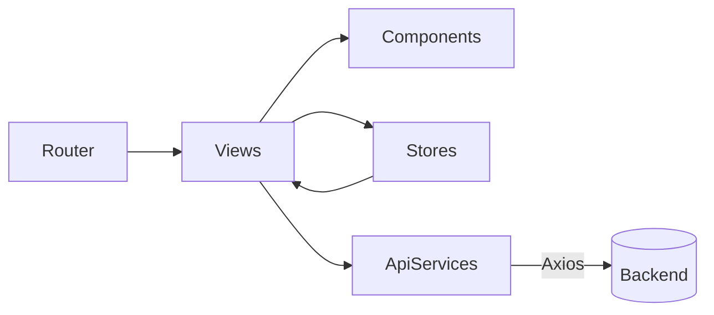
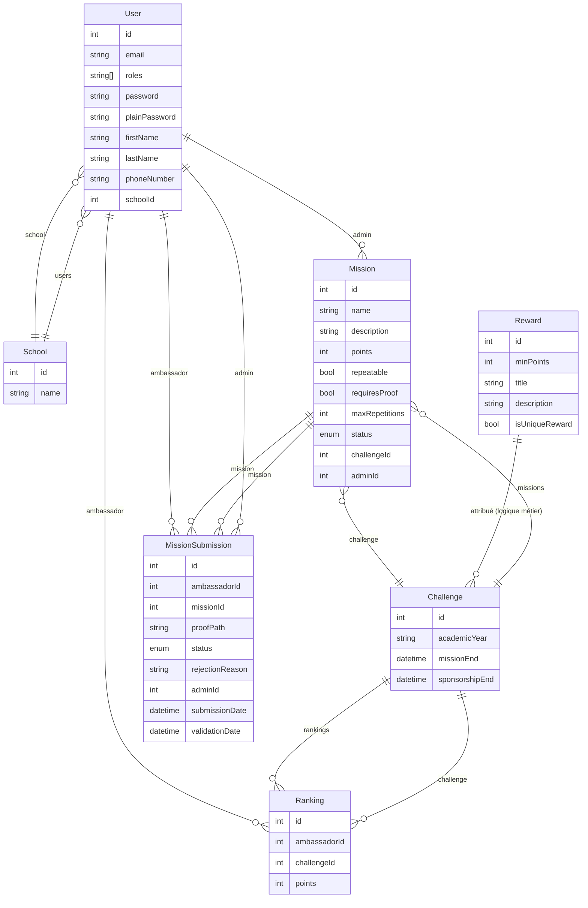

Ce document regroupe plusieurs schémas Mermaid pour illustrer le fonctionnement général du projet **Challenge Ambassadeur**.

## Vue d'ensemble du système

## Modèle de données simplifié

## Flux d'authentification

## Architecture Frontend (simplifiée)

## Diagramme de base de données complet

